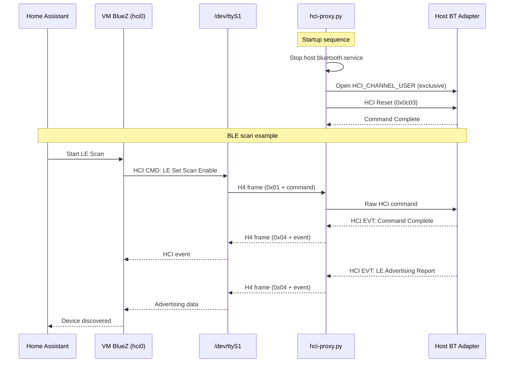

# bt-proxy: Bluetooth HCI Proxy for Virtualized Home Assistant

A proxy that forwards Bluetooth HCI packets from a Linux host's Bluetooth adapter to a Home Assistant OS (HAOS) VM, enabling full Bluetooth support without USB passthrough.

## The Problem

Intel CNVi Bluetooth adapters (combo WiFi+BT cards integrated into the chipset) are **fundamentally incompatible with QEMU USB passthrough**:

- The adapter depends on the host's `btusb` driver for firmware loading and USB enumeration
- Unloading `btusb` causes the device to disappear from the USB bus entirely
- QEMU's USB reset during passthrough puts the device into bootloader mode, and firmware reload fails from the VM side
- Blacklisting `btusb` makes the device vanish permanently until reboot

This means a HAOS VM on a host with only an Intel CNVi adapter has no way to access Bluetooth through standard USB passthrough.

See Appendix A for complete details

## The Solution

Instead of passing the USB device, we proxy raw HCI packets between the host and VM over a serial port backed by a UNIX socket.

The host-side proxy (`hci-proxy.py`) opens the Bluetooth adapter using `HCI_CHANNEL_USER` (exclusive raw HCI access, bypassing the host's BlueZ stack) and forwards packets to the VM using H4 (UART Transport) framing. Inside the VM, a Home Assistant Add-on runs `btattach` to create a standard HCI device from the serial port, which BlueZ uses normally. The add-on persists across reboots and auto-restarts on failure.

## Architecture

```mermaid
graph LR
    subgraph Host ["Linux Host"]
        BT["Intel BT Adapter<br/>(CNVi)"]
        BTUSB["btusb driver<br/>(firmware loaded)"]
        PROXY["hci-proxy.py<br/>(HCI_CHANNEL_USER)"]
        SOCK["/run/bt-hci-proxy.sock<br/>(UNIX socket)"]

        BT <-->|USB| BTUSB
        BTUSB <-->|Raw HCI| PROXY
        PROXY <-->|H4 frames| SOCK
    end

    subgraph VM ["HAOS VM (libvirt/KVM)"]
        TTY["/dev/ttyS1<br/>(ISA serial port)"]
        subgraph ADDON ["HA Add-on (Docker)"]
            ATTACH["btattach -B /dev/ttyS1 -P h4"]
        end
        UART["hci_uart<br/>kernel module"]
        BLUEZ["BlueZ / hci0"]
        HA["Home Assistant<br/>Bluetooth Integration"]

        TTY <-->|serial| ATTACH
        ATTACH <-->|line discipline| UART
        UART <-->|HCI| BLUEZ
        BLUEZ <-->|D-Bus| HA
    end

    SOCK <-->|"libvirt serial<br/>port backend"| TTY
```



### Data Flow



## How It Works

### H4 UART Transport Protocol

Each HCI packet is prefixed with a 1-byte type indicator:

| Type Byte | Packet Type | Direction |
|-----------|-------------|-----------|
| `0x01` | HCI Command | Host → Controller |
| `0x02` | ACL Data | Bidirectional |
| `0x03` | SCO Data | Bidirectional |
| `0x04` | HCI Event | Controller → Host |
| `0x05` | ISO Data | Bidirectional (BT 5.2+) |

The proxy parses HCI packet headers to determine packet boundaries (each type has a defined header format with an embedded length field), reassembles complete packets from the stream, and forwards them in both directions.

### Key Technical Details

- **HCI_CHANNEL_USER**: A Linux-specific raw HCI socket mode (`AF_BLUETOOTH`, `BTPROTO_HCI`, channel=1) that provides exclusive, unfiltered access to the Bluetooth controller. Requires the device to be "down" first and `CAP_NET_ADMIN` + `CAP_NET_RAW`.

- **ISA serial port (not virtio-serial)**: `btattach` requires a device that supports termios ioctls. Virtio-serial char devices don't support these, so we use an ISA serial port (`/dev/ttyS1`) which is a proper tty device.

- **HCI Reset on startup**: The proxy sends an HCI Reset command when it starts to clear any stale scanning or advertising state left from the host's BlueZ session, preventing command timeouts.

- **ctypes for socket bind**: Python's `socket.bind()` doesn't support the `sockaddr_hci` format, so we call libc's `bind()` directly via ctypes.

## Files

| File | Description |
|------|-------------|
| `hci-proxy.py` | Host-side proxy script (deploy to `/usr/local/bin/`) |
| `hci-proxy.service` | systemd unit for the proxy (deploy to `/etc/systemd/system/`) |
| `vm-channel.xml` | libvirt XML snippet to add the serial port to the VM |
| `bt-hci-proxy/` | Home Assistant Add-on for btattach persistence |

## Installation

### 1. Add a serial port to the VM

Edit the VM XML (`virsh edit <vm-name>`) and add the contents of `vm-channel.xml` inside the `<devices>` section, after the existing `<serial type='pty'>` block. Then restart the VM:

```sh
sudo virsh shutdown <vm-name>
# wait for it to stop
sudo virsh start <vm-name>
```

### 2. Install the proxy on the host

```sh
sudo cp hci-proxy.py /usr/local/bin/hci-proxy.py
sudo chmod +x /usr/local/bin/hci-proxy.py
sudo cp hci-proxy.service /etc/systemd/system/
sudo systemctl daemon-reload
sudo systemctl enable --now hci-proxy
```

### 3. Install the btattach add-on in HAOS

The HA Add-on runs `btattach` inside the VM to create an HCI device from the serial port. It persists across reboots and auto-restarts on failure.

**Option A: Local add-on**

Copy the `bt-hci-proxy/` directory to `/addons/bt-hci-proxy/` on HAOS (via Samba share or SSH), then:

1. Go to **Settings > Add-ons > Add-on Store**
2. Click the three-dot menu (top right) > **Check for updates**
3. Find **BT HCI Proxy** under "Local add-ons"
4. Click **Install**, then **Start**

**Option B: Add-on repository**

If this repo is hosted on GitHub, add it as a custom add-on repository:

1. Go to **Settings > Add-ons > Add-on Store**
2. Click the three-dot menu > **Repositories**
3. Add the repository URL (e.g. `https://github.com/nlothian/homeassistant-bt-proxy`)
4. Find **BT HCI Proxy** and install it

The add-on defaults to `/dev/ttyS1` with protocol `h4` and passive scanning enabled. These can be changed in the add-on's **Configuration** tab if needed.

### 4. Verify

On the host:
```sh
systemctl status hci-proxy
# Should show: "Opened HCI_CHANNEL_USER on hci0"
# and: "Connected to virtio-serial at /run/bt-hci-proxy.sock"
```

In the HA UI, check the add-on logs (**Settings > Add-ons > BT HCI Proxy > Log**):
```
INFO: Attaching Bluetooth UART on /dev/ttyS1 with protocol h4...
INFO: btattach running (PID ...)
```

Inside the VM (via SSH or Terminal add-on):
```sh
bluetoothctl show
# Should show the controller with the host adapter's MAC address
```

Home Assistant's Bluetooth integration should transition from `setup_retry` to `loaded`.

## Notes

- **Passive scanning**: The latency added by the proxy path may prevent active BLE scanning from working reliably. The add-on enables passive scanning on the adapter by default (via `btmgmt`). You can disable this by setting `passive_scan: false` in the add-on configuration. You may also need to enable the passive scanning option in the relevant Home Assistant integration. Passive scanning is sufficient for most BLE devices.

- **HAOS read-only filesystem**: HAOS uses a read-only root filesystem (erofs), so `btattach` can't be persisted as a systemd unit inside the VM. The HA Add-on (`bt-hci-proxy/`) solves this by running `btattach` in a managed Docker container that persists across reboots.

- **Host BlueZ is stopped**: The proxy requires exclusive adapter access, so `bluetooth.service` on the host is automatically stopped. The host cannot use Bluetooth while the proxy is running.

## Troubleshooting

| Symptom | Check |
|---------|-------|
| Proxy fails to open HCI socket | `systemctl status bluetooth` — must be stopped |
| "Address already in use" on HCI bind | Another process has the adapter; stop bluetooth.service |
| UNIX socket missing on host | VM must be running; check `virsh list` |
| `/dev/ttyS1` missing in VM | Verify serial XML was added correctly |
| btattach fails with ioctl error | Ensure using `/dev/ttyS1` (serial port), not a virtio-ports device |
| Add-on shows "Resource busy" | A previous btattach left the line discipline attached; the add-on detects hci0 and monitors it — this is normal |
| Add-on shows "hci0 disappeared" | The add-on will auto-restart and re-attach; check that hci-proxy is running on the host |
| HA still in setup_retry | Restart the Bluetooth integration after hci0 appears |
| Passive scanning warning | Enable passive scanning in the integration settings |
| HCI command timeouts in dmesg | Restart hci-proxy to trigger a fresh HCI Reset |

## Requirements

- **Host**: Linux with BlueZ, Python 3.10+, libvirt/KVM
- **VM**: Home Assistant OS (or any Linux VM with `btattach` and `hci_uart` module)
- **Bluetooth adapter**: Any adapter supported by the host kernel (designed for Intel CNVi but should work with any adapter)


# Appendix A - Detailed Problem Description

This is mostly so anyone searching for Intel Bluetooth 9460/9560 (CNVi) problems with virtual machines might find these details. In my case I'm using a fanless Bosgame AG40 with Celeron N4020.


### What We Tried (USB Passthrough) — Failed

We attempted standard QEMU USB passthrough of the Intel BT adapter to the VM:

1. **`managed='yes'` passthrough**: libvirt's automatic driver detach didn't properly unbind `btusb` from the host. The host driver remained bound, and the VM couldn't use the device.

2. **Manual btusb unbind + passthrough**: When `btusb` is unloaded on the host, the Intel CNVi adapter **disappears entirely from the USB bus** (error -71, "unable to enumerate USB device"). This is because the CNVi device depends on firmware loaded by `btusb` to remain visible on USB.

3. **UHCI controller issue**: Initially the device landed on a USB 1.1 (UHCI) controller in the VM, causing firmware load timeouts. We added a `qemu-xhci` USB 3.0 controller.

4. **xHCI passthrough**: With xHCI, the VM detected the device and found the firmware file (`intel/ibt-17-16-1.sfi`), but firmware download failed with `-19 (ENODEV)`. The host's `btusb` had already loaded firmware; when QEMU reset the USB device for passthrough, it went back to bootloader mode, and the VM's firmware reload failed.

5. **Blacklisting btusb**: Blacklisting on the host causes the CNVi device to vanish from USB entirely. Multiple reset cycles put the device in an unrecoverable state requiring a full host reboot.

**Root cause**: Intel CNVi Bluetooth adapters are fundamentally incompatible with QEMU USB passthrough due to their tight coupling with the host's `btusb` driver for firmware loading and USB enumeration.

### What Works Inside HAOS

When HAOS is installed directly on bare metal (no VM), the Intel adapter works perfectly — HAOS's kernel and BlueZ handle the firmware loading natively.